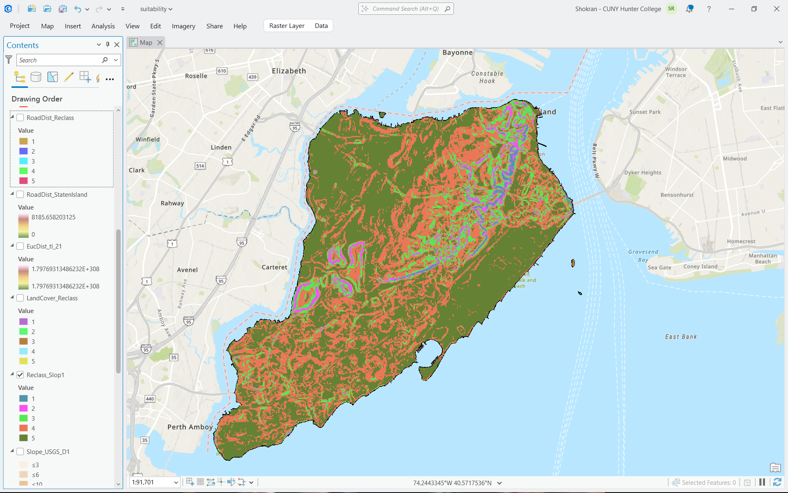
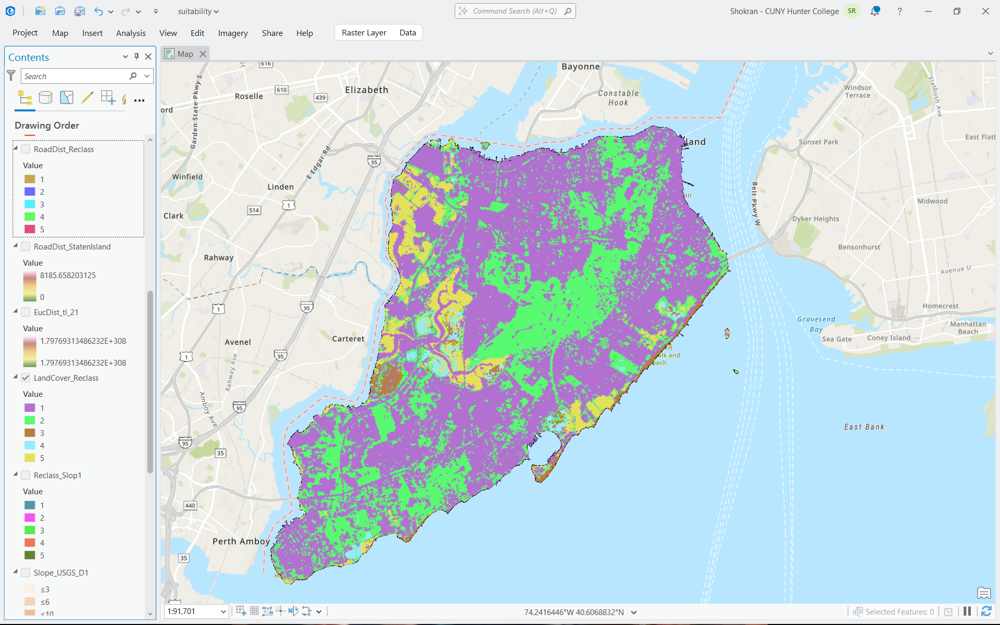
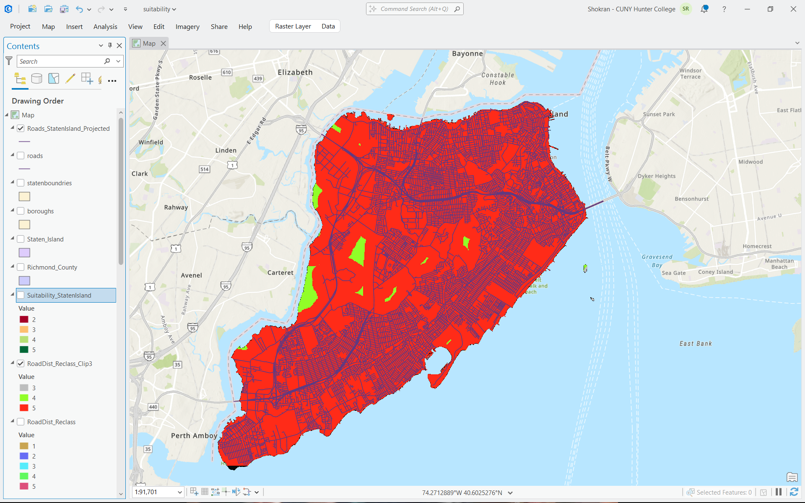
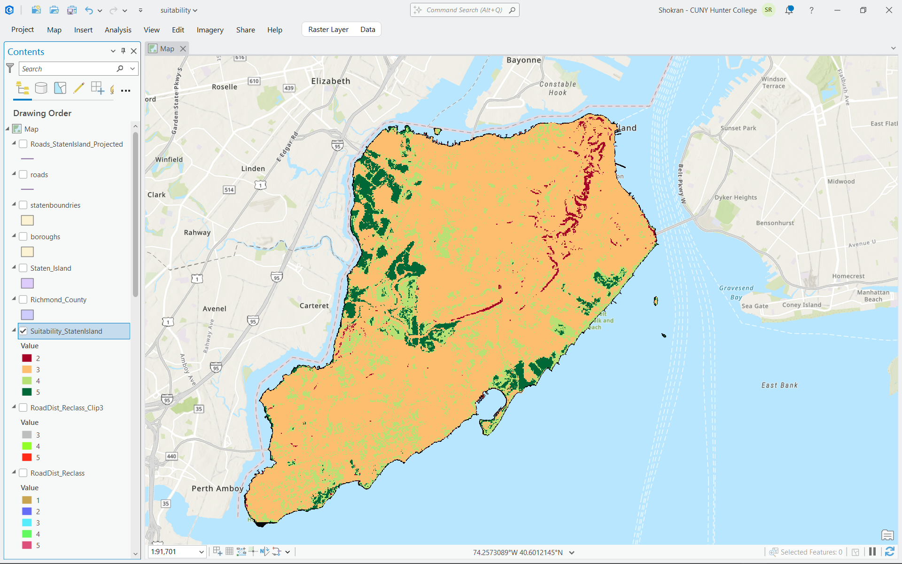

# Suitability Modeling Lab

Siting a Community Solar Installation - Staten Island, NYC

<a href="../lessons/index.md#suitability-modeling">&larr; Back to Lessons</a>

Contents - click a layer to open

<h2 id="student-handout" class="sr-anchor">Student Handout</h2>
<button class="layer" aria-expanded="false" aria-controls="panel-handout" onclick="toggleOpen(this,'panel-handout')">
&#10003;

Student Handout open
Scenario, tasks, and deliverables

&#9654;
</button>

<h2>Scenario</h2>

Staten Island's public works department wants to site a small, community-scale solar installation on municipal land. Rather than picking a spot by guesswork, you will build a site-suitability model: a single map that scores every location on the island from least to most suitable, by combining three separate criteria into one weighted answer.

Where earlier topics asked a single, objective question ("which counties meet condition X," "which robberies are near a park"), this lab asks a genuinely different kind of question: given several things that all matter, and matter by different amounts, where is the best overall compromise? That's what a weighted suitability model is for.

<h2>The three criteria, and why each one matters</h2>
<ul>
<li><b>Slope</b> - flatter land is cheaper and safer to build a solar array on. Steep land requires expensive grading and racking.</li>
<li><b>Land cover</b> - open or already-disturbed land (crops, grass, bare ground) is far cheaper and less controversial to build on than forest (which must be cleared) or water/wetland (which usually cannot legally be built on at all).</li>
<li><b>Proximity to roads</b> - closer to existing roads means cheaper construction access and cheaper grid interconnection.</li>
</ul>
<h2>Tasks</h2>
<ol>
<li>Download a Digital Elevation Model (DEM), NLCD land cover, and Census TIGER roads/county boundary covering Staten Island (Richmond County), NY.</li>
<li>Build an ArcGIS Pro project, clip all three datasets to Staten Island's real boundary.</li>
<li>Derive a Slope layer from the DEM and reclassify it onto a 1-5 suitability scale.</li>
<li>Reclassify the NLCD land cover layer onto the same 1-5 scale.</li>
<li>Calculate distance to roads and reclassify it onto the same 1-5 scale.</li>
<li>Combine all three criteria with Weighted Overlay (Land Cover 40%, Slope 35%, Road Proximity 25%) into a single suitability raster.</li>
<li>Symbolize the result, build a layout, and export a JPEG.</li>
</ol>
<h2>Deliverables</h2>
<ul>
<li>Screenshots of the Slope, Reclassify (all three criteria), Euclidean Distance, and Weighted Overlay dialogs showing your actual parameters.</li>
<li>The final suitability raster, symbolized from red (least suitable) to green (most suitable).</li>
<li>The final exported JPEG map layout.</li>
<li>A short paragraph (3-5 sentences) identifying where the most suitable areas are, and explaining, in terms of the three input criteria, why.</li>
</ul>

<h2 id="data-acquisition" class="sr-anchor">Data Acquisition Instructions</h2>
<button class="layer" aria-expanded="false" aria-controls="panel-data" onclick="toggleOpen(this,'panel-data')">
&#10003;

Data Acquisition Instructions open
Click-by-click: downloading the DEM, land cover, and roads/boundary data

&#9654;
</button>

All three sources below require no account or login of any kind.

<h2>Part 1 - Elevation: USGS 1/3 Arc-Second DEM (The National Map Downloader)</h2>
<ol>
<li>Go to <code>apps.nationalmap.gov/downloader/</code>. No account is required.</li>
<li>Datasets tab, check "Elevation Products (3D Elevation Program Products and Services)", expand its Subcategories (click the small arrow, separate from the checkbox), check only "1/3 arc-second DEM."</li>
<li>On the map, navigate to Staten Island, NY and draw a box comfortably covering the island.</li>
<li>Scroll down, click "Search Products."</li>
<li>Click "Download Link (TIF)" on the matching result.</li>
</ol>
<h2>Part 2 - Land Cover: NLCD, via the MRLC Viewer</h2>
<ol>
<li>Go to <code>mrlc.gov/viewer/</code>. Under Annual NLCD, double-click Land Cover to open it.</li>
<li>In the Tools, Data Download panel, set Method: Rectangle. Draw the rectangle directly over Staten Island.</li>
</ol>

<b>Watch out:</b> Do not click the blue "Download Land Cover Reference Data" button. That downloads a nationwide (CONUS-wide) reference accuracy file over 1 GB in size, not a clipped area, and not what this lab needs.

<ol start="3">
<li>Confirm GeoTIFF is checked under Download Contents, and only "Land Cover" is checked under Select Categories.</li>
<li>Under Select Years, drag the slider to a single year (e.g., 2025-2025), not a multi-year range.</li>
<li>Enter your email, click Download.</li>
</ol>

<b>Note:</b> You'll receive an immediate confirmation email with an Order Number, that is only a receipt, not your file. A second email with the actual download link arrives later, typically within minutes for an area this small.

<h2>Part 3 - Roads and County Boundary: Census TIGER/Line</h2>
<ol>
<li>Go to <code>census.gov/cgi-bin/geo/shapefiles/index.php</code>. Select the current year, layer type Roads, then New York, Richmond County (Staten Island's official county name).</li>
<li>Repeat, selecting layer type "Counties (and equivalent)" for the boundary, not "County Subdivisions," which is a different, smaller geography.</li>
</ol>

<h2 id="project-instructions" class="sr-anchor">Project Instructions</h2>
<button class="layer" aria-expanded="false" aria-controls="panel-proj" onclick="toggleGated(this,'panel-proj')">
&#128274;

Project Instructions locked
Full ArcGIS Pro walkthrough, step by step. Enter your access code to view.

&#9654;
</button>

Enter the access code your instructor gave you to view the Project Instructions.

<input type="text" class="gate-input" id="gateinput-proj" placeholder="Access code">
<button type="button" class="gate-btn" onclick="checkCode('proj')">Unlock</button>

Incorrect code, please try again.

<h2>Project Instructions</h2>

<i>Siting a Community Solar Installation - Staten Island, NYC. Spatial Analysis, Suitability Modeling.</i>

<h3>Part 1 - Project Setup and Clipping to Staten Island</h3>
<ol>
<li>Create a project folder with a Data subfolder. Add the DEM, NLCD, roads shapefile, and national counties shapefile to a new ArcGIS Pro project.</li>
<li>Isolate Richmond County: open the counties layer's attribute table, Select By Attributes where NAME = 'Richmond' and STATEFP = '36', then Export Features, name it <code>RichmondCounty_Boundary</code>.</li>
<li>Clip Raster: Input = DEM, Output Extent = <code>RichmondCounty_Boundary</code>, check "Use Input Features for Clipping Geometry" (so the clip follows the real coastline, not a rectangle), output <code>DEM_StatenIsland</code>.</li>
<li>Repeat Clip Raster on the NLCD layer, output <code>NLCD_StatenIsland</code>.</li>
<li>Clip (the vector tool, not Clip Raster) on the roads layer, Clip Features = <code>RichmondCounty_Boundary</code>, output <code>Roads_StatenIsland</code>.</li>
</ol>

<b>Why this step:</b> Every criterion needs to describe the same physical area. If one input layer is clipped to the island and another still covers a larger rectangle, Weighted Overlay can silently produce a result only where all three inputs overlap, quietly cutting off part of the real study area without any error message.

<h3>Part 2 - Slope Criterion</h3>

<b>Step 1: Check your DEM's coordinate system before running Slope</b>

<ol>
<li>Right-click the DEM layer, Properties, Source tab, check Spatial Reference.</li>
<li>If it reads "GCS_..." (Geographic Coordinate System, plain lat/long), Percent Rise slope will not be scientifically valid, since horizontal degrees can't be reconciled with vertical meters. If so, first run "Project Raster" to a projected system such as NAD 1983 UTM Zone 18N, and use that output below instead.</li>
</ol>

<b>Step 2: Run Slope</b>

<ol start="3">
<li>Analysis tab, Tools, search "Slope." Input raster: your DEM. Output raster: <code>Slope_StatenIsland</code>.</li>
<li>Output measurement: change from the default Degree to Percent Rise.</li>
<li>Z factor: leave at 1. Method: leave at Planar.</li>
</ol>

<b>Watch out:</b> Before clicking Run, check the Environments tab, "Target device for analysis." If set to GPU_THEN_CPU, change it to CPU Only. Leaving it on GPU caused an instant failure (under 1 second, generic "ERROR 999999") in testing, switching to CPU fixed it immediately.

<b>Step 3: Reclassify the Slope output</b>

<ol start="6">
<li>Search "Reclassify." Input raster: <code>Slope_StatenIsland</code>. Reclass field: Value.</li>
</ol>

<b>Note:</b> The tool auto-generates its own breakpoints (11 rows by default) as soon as you pick the input, you don't need a separate "Classify" popup if one doesn't visibly open (it can occasionally open behind other windows), editing the existing table directly works just as well.

<ol start="7">
<li>Edit the first 5 rows to read 0-3, 3-8, 8-15, 15-25, and 25-[well above your max, e.g. 1000]. Double-click a cell to select its text, type over it, press Tab/Enter to confirm. Delete any extra rows beyond these 5 (down to, but not including, NODATA).</li>
</ol>

<b>Watch out:</b> Double-check the last row's End value specifically, in testing it read Start=25, End=20 (backwards/invalid, since 20 is less than 25). Fix it to your real max if this happens.

<ol start="8">
<li>Set the New column, top to bottom: 5, 4, 3, 2, 1.</li>
</ol>

<b>Why this step:</b> 0-3% and 3-8% slope (top two rows) are the thresholds commonly treated as "easily buildable" and "buildable with standard grading" in site-development practice; above roughly 25% slope, construction cost and erosion risk rise sharply. Assigning these ranges scores of 5 down to 1 directly encodes "flatter is better" into the model in a way Weighted Overlay can combine with the other two criteria.

<b>Watch out:</b> This New-value ordering is descending, not ascending, it's easy to type 1,2,3,4,5 out of habit. The flattest row must get the highest score (5).

<ol start="9">
<li>Output raster: <code>Slope_Reclass</code> (or whatever name you actually used, in testing this was left as ArcGIS's suggested "Reclass_Slop1", which works identically; just track whichever name you chose for Part 5 later). Click Run.</li>
</ol>

<h3>Part 3 - Land Cover Criterion</h3>
<ol>
<li>Open Reclassify. Input raster: <code>NLCD_StatenIsland</code>. Reclass field: Value.</li>
<li>Click "Unique" (not "Classify"), land cover is categorical, not continuous, so we want one row per actual code present, not a numeric range.</li>
</ol>

<b>Why this step:</b> Unlike Slope's smooth numeric gradient, NLCD codes are unordered category labels (11 = Open Water, 82 = Cultivated Crops, etc.), there is no meaningful "between 41 and 82." Unique lets us assign each real category its own suitability score directly.

<ol start="3">
<li>Go through every row present and set its New value according to this suitability logic:
<ul>
<li>82 (Cultivated Crops) &rarr; 5 - already-disturbed, open, effectively the easiest possible land to build on</li>
<li>71, 81 (Grassland/Herbaceous, Pasture/Hay) &rarr; 4 - open and largely undeveloped</li>
<li>52, 31 (Shrub/Scrub, Barren Land) &rarr; 3 - usable but less common / more marginal</li>
<li>41, 42, 43 (all Forest types), 21, 22 (Developed Open Space/Low Intensity) &rarr; 2 - forest requires costly clearing; light development has competing use</li>
<li>23, 24 (Developed Medium/High Intensity), 11 (Open Water), 90, 95 (Wetlands) &rarr; 1 - already built up, or legally/physically unbuildable</li>
</ul>
</li>
</ol>

<b>Watch out:</b> If any row's code isn't in the list above, don't guess or leave it blank, stop and check the code against the NLCD legend before assigning a value. In testing, Staten Island's actual data included several rows (22, 23, 31, 81, 82, 90, 95) that still showed ArcGIS's leftover auto-generated default numbers (things like 6, 11, 12, 13, impossible under a 1-5 scale) until manually corrected one at a time. Any value outside 1-5 remaining in the table is a clear sign a row still needs fixing.

<ol start="4">
<li>Output raster: <code>LandCover_Reclass</code>. Click Run.</li>
</ol>

<h3>Part 4 - Road Proximity Criterion</h3>

<b>Step 1: Euclidean Distance</b>

<ol>
<li>Search "Euclidean Distance" (Spatial Analyst Tools, Distance). Input: <code>Roads_StatenIsland</code> (or roads). Output: <code>RoadDist_StatenIsland</code>.</li>
<li>Maximum distance: leave blank. Output cell size: leave at the default (should already match your other rasters, e.g. 30). Output direction raster: leave blank.</li>
</ol>

<b>Note:</b> You may see a message that this tool is deprecated in favor of "Distance Accumulation." Euclidean Distance still works correctly on current ArcGIS Pro, this is only a heads-up that it may not exist in some future version.

<b>Note:</b> "Input raster or feature barrier data" can be left blank. Barriers are for measuring distance around something physically blocking a straight path (e.g., a lake). This lab intentionally measures plain straight-line distance from roads, matching how the reclassification below is defined, adding a barrier would change the type of analysis, not just add precision.

<b>Why this step:</b> Proximity to roads is a proxy for construction and grid-connection cost, the closer a candidate site is to existing infrastructure, the cheaper it is to build and connect. Straight-line (Euclidean) distance is the simplest, standard way to express "how close," and is the appropriate choice for a criterion meant to be combined with two other raster criteria in Weighted Overlay.

<b>Watch out:</b> Check your roads layer's coordinate system before running this. In testing, the roads layer (and the project's Map itself) were in a Geographic Coordinate System (plain lat/long degrees, e.g. NAD 1983, WKID 4269) rather than a projected one. Running Euclidean Distance in that state produced a result whose Value legend showed 1.79769313486232E+308 at both ends, the maximum number a computer can represent, effectively a "broken/undefined" sentinel repeated across the whole raster, not a real distance.

<ol start="3">
<li>To fix: right-click Map (top of Contents), Properties, Coordinate Systems tab, search and select "NAD 1983 UTM Zone 18N", OK.</li>
<li>Then search the vector "Project" tool (not "Project Raster"): Input = roads, Output Coordinate System = NAD 1983 UTM Zone 18N, output <code>Roads_StatenIsland_Projected</code>.</li>
<li>Re-run Euclidean Distance using <code>Roads_StatenIsland_Projected</code> as the input instead of the original roads.</li>
</ol>

<b>Note:</b> After this fix, a successful run shows a real, reasonable value range, in testing, roughly 0 to 8,185 meters (about 5 miles), a plausible maximum distance-to-nearest-road for the most remote corners of the island's protected Greenbelt area. That kind of sane, real-world number range is the confirmation the fix worked, not just the absence of an error banner.

<b>Step 2: Reclassify</b>

<ol start="6">
<li>Search Reclassify. Input raster: your Euclidean Distance output. Reclass field: Value.</li>
<li>Click "Classify..." (continuous data, like Slope, not "Unique," which was for categorical land cover). Method: Manual, Classes: 5.</li>
<li>Break Values: 500, 1500, 3000, 6000, and leave the 5th/top break at its auto-filled maximum.</li>
<li>New column, top to bottom: 5, 4, 3, 2, 1.</li>
</ol>

<b>Why this step:</b> Closer to a road (top row, 0-500m) means cheaper construction access and grid interconnection, so it earns the highest suitability score, the same descending-score logic as Slope, just applied to a different measurement.

<ol start="10">
<li>Output raster: <code>RoadDist_Reclass</code>. Click Run.</li>
</ol>

<b>Step 3: Re-clip to the real island boundary</b>

<b>Watch out:</b> Euclidean Distance and its Reclassify were likely calculated using an unclipped or rectangular roads/distance extent, which can extend into open water or neighboring New Jersey. Before this layer can be used in Weighted Overlay, it must be clipped to match <code>Slope_Reclass</code> and <code>LandCover_Reclass</code>, which are already properly clipped.

<ol start="11">
<li>Search Clip Raster. Input Raster: <code>RoadDist_Reclass</code>. Output Extent: <code>RichmondCounty_Boundary</code>, with "Use Input Features for Clipping Geometry" checked. Output name: <code>RoadDist_Reclass_Clip</code>.</li>
</ol>

<b>Note:</b> After clipping, you may see classes 1 and 2 disappear from the layer, and the display colors reassign themselves automatically. Both are expected: those farthest-distance classes only existed in areas that were never really Staten Island (ocean, NJ), and ArcGIS Pro recolors a layer's default symbology based on whichever values actually remain, the underlying numbers (3, 4, 5) are unaffected and still mean exactly what they meant before. Use this clipped layer, not the original <code>RoadDist_Reclass</code>, going forward.

<h3>Part 5 - Weighted Overlay</h3>
<ol>
<li>Search "Weighted Overlay." Confirm Evaluation Scale reads "1 to 5 by 1."</li>
<li>Add three raster rows (the "+" button). Set each Raster dropdown to: <code>LandCover_Reclass</code>, your Slope reclass output, and your clipped RoadDist reclass output.</li>
</ol>

<b>Watch out:</b> If both a clipped and unclipped version of the RoadDist layer still exist in your project (likely, since we don't delete intermediate outputs), make sure you select the clipped one here. Picking the wrong one silently reintroduces the extent mismatch that Part 4's last step specifically fixed.

<ol start="3">
<li>For each of the three rows, expand its Scale Value sub-mapping and confirm it shows a plain identity map (1&rarr;1, 2&rarr;2, 3&rarr;3, 4&rarr;4, 5&rarr;5). Check every row individually, don't assume the second and third rows match just because the first one did.</li>
<li>Set % Influence: Land Cover = 40, Slope = 35, Road Proximity = 25.</li>
</ol>

<b>Why this step:</b> The three weights are not arbitrary: Land Cover gets the largest share (40%) because it behaves closest to a hard constraint, water, wetland, and dense development aren't just "less convenient," they're frequently impossible to build on at all, legally or physically. Slope gets the second-largest share (35%) because terrain is a major cost driver, though rarely an absolute barrier until quite steep. Road Proximity gets the smallest share (25%) because it's the most flexible of the three, a great site that's simply far from a road can still be developed with a more expensive grid connection, whereas bad land cover or extreme slope are much harder to design around.

<ol start="5">
<li>Confirm the three percentages sum to exactly 100.</li>
<li>Output raster: <code>Suitability_StatenIsland</code>. Click Run.</li>
</ol>

<b>Note:</b> If Weighted Overlay is grayed out, check Project tab, Licensing for the Spatial Analyst extension.

<h3>Part 6 - Symbolize, Build Layout, Export JPEG</h3>
<ol>
<li>Symbolize <code>Suitability_StatenIsland</code> with a color ramp running red (1, least suitable) to green (5, most suitable).</li>
<li>Insert tab, New Layout, Letter (ANSI), Landscape.</li>
<li>Insert tab, Map Frame, place it, frame Staten Island.</li>
<li>Insert tab, add Legend, North Arrow, Scale Bar. Add a title via Insert, Text, Straight Text Box reading "Solar Site Suitability - Staten Island, NY."</li>
<li>Share tab, Export Layout, JPEG, your Maps folder.</li>
</ol>

<h2 id="result-reference" class="sr-anchor">Result Reference</h2>
<button class="layer" aria-expanded="false" aria-controls="panel-result" onclick="toggleGated(this,'panel-result')">
&#128274;

Result Reference locked
Verified reference outputs to check your work. Enter your access code to view.

&#9654;
</button>

Enter the access code your instructor gave you to view the Result Reference.

<input type="text" class="gate-input" id="gateinput-result" placeholder="Access code">
<button type="button" class="gate-btn" onclick="checkCode('result')">Unlock</button>

Incorrect code, please try again.

<h2>Result Reference</h2>

<i>Siting a Community Solar Installation - Staten Island, NYC. Spatial Analysis, Suitability Modeling.</i>

<h3>Reference Answer Key - Verified Results</h3>

These are real, verified outputs from a successful run of this lab, generated on Staten Island (Richmond County) data. Use them to check your own results for a similar overall pattern, your exact colors depend on your own symbology choices, but the spatial pattern should be comparable.

Slope_Reclass: 1 (steepest, &lt;25%) through 5 (flattest, 0-3%).

<b>What you're looking at:</b> this map is dominated by the flattest two classes. That is a correct, expected result, not an error, Staten Island, like most of NYC's outer boroughs, is genuinely low-relief terrain. A slope map dominated by "flat" classes reflects real geography here.

<b>Note:</b> A quick way to confirm this without just trusting the colors: right-click <code>Slope_Reclass</code>, Attribute Table, and check that classes 4 and 5 have the largest Count values.

LandCover_Reclass: 1 (water/wetland/dense development) through 5 (cultivated/open land).

<b>What you're looking at:</b> purple (value 1, least suitable) covers large areas, consistent with how heavily developed much of Staten Island is. Green (value 2, forest and light development) traces the island's wooded Greenbelt interior. Yellow/tan (values 4-5) appear only as small, scattered patches, Staten Island has very little actual farmland, so high scores here are genuinely rare, not a sign that something was skipped.

RoadDist_Reclass, correctly clipped to the island: red (5, closest to roads) through blue (2, farthest).

<b>What you're looking at:</b> red hugs the dense street network, fading outward through green, cyan, and blue as distance increases, exactly the expected pattern for a distance-based score.

<b>Note:</b> Notice classes 1 and 2 (the very farthest distances) are largely or entirely absent once properly clipped to the real island boundary. That is expected: Staten Island is dense enough that almost no point on the actual island is more than a few kilometers from a mapped road. Those farthest classes only existed in an earlier, incorrectly large rectangular version of this layer that extended into open water and New Jersey, clipping to the real coastline correctly removed them.

Suitability_StatenIsland: the three criteria combined, 40/35/25 weighting.

<b>What you're looking at:</b> orange (value 3, the "middle" score) dominates most of the island, consistent with typical mixed residential/developed land that is neither ideal nor terrible on any single criterion. Dark green (value 5, best) clusters in a band through the island's interior, broadly aligned with the Greenbelt corridor.

<b>Watch out:</b> Read this pattern carefully rather than at a glance: the Greenbelt is also heavily forested, and forest scored low (2) on the land cover criterion specifically. Before concluding an area is genuinely well-suited, cross-reference a few of the darkest-green pixels' locations against <code>LandCover_Reclass</code> at that same spot, to confirm they are getting a real land-cover boost rather than only riding on good slope and road access.

<b>Note:</b> The very lowest class (1) does not appear anywhere in the final result, even though all three input layers contain it. This is expected: Weighted Overlay computes a weighted average and rounds to the nearest whole class, so a pixel only becomes class 1 if it scores badly on all three criteria simultaneously. On a small, densely-networked island where almost nowhere is genuinely far from a road, that combination is rare, so class 1 quietly disappearing in the blended result is a believable outcome of the math, not a sign that a layer failed to load.

<footer>Slope_Reclass / LandCover_Reclass / RoadDist_Reclass_Clip / Suitability_StatenIsland</footer>

<a href="surface-analysis.md">Surface Analysis</a>

