# Lessons

Lessons are guided tutorials. Each one combines a GIS concept, an ArcGIS Pro workflow, and a practice task.

## Full course topic list

A date-free, college-agnostic view of every topic in the course. This list isn't tied to any single semester's calendar, so each section (regardless of institution) can pace the material however it needs. A topic title opens its lesson or concept page; the Slides column opens the matching deck.

| Modules | Topics | Slides | Labs | Readings |
|---|---|---|---|---|
| Introduction, Foundations, and Data Management | [Course Overview and Intro](00-introduction-to-gis.md); [Software Installation](00-introduction-to-gis.md) | <a class="deck" href="../slides/introduction-to-gis/" title="Slides: Course Overview and Intro">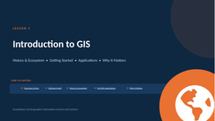</a>  | — | [Esri: Introduction to ArcGIS Pro](https://doc.esri.com/en/arcgis-pro/latest/get-started/get-started.html){: .src-esri}; [Esri Tutorial Path: Try ArcGIS Pro](https://learn.arcgis.com/en/paths/try-arcgis-pro/){: .src-esri}; [Flexible GIS Workbook: Setup Before You Begin](https://mlpp.pressbooks.pub/flexiblegisworkbookpro/front-matter/setup-before-you-begin/){: .src-workbook} |
| Introduction, Foundations, and Data Management | [History of GIS and ArcGIS Ecosystem](00-introduction-to-gis.md) |  | — | [GIS & Cartography: 1.1 Introduction](https://slcc.pressbooks.pub/maps/chapter/1-1/){: .src-cartography}; [Essentials of GIS: Ch. 1 Introduction](https://saylordotorg.github.io/text_essentials-of-geographic-information-systems/s05-introduction.html){: .src-essentials} |
| Introduction, Foundations, and Data Management | [GIS/GISc Applications](00-introduction-to-gis.md); [Why GIS/GISc Matter](00-introduction-to-gis.md) |   | — | [GIS & Cartography: 1.3 Geospatial Technology](https://slcc.pressbooks.pub/maps/chapter/1-3/){: .src-cartography}; [GIS & Cartography: 1.2 Geographic Science](https://slcc.pressbooks.pub/maps/chapter/1-2/){: .src-cartography} |
| Introduction, Foundations, and Data Management | [The Politics and Ethics of Mapping](00-introduction-to-gis.md) | <a class="deck" href="../slides/politics-ethics-of-mapping/" title="Slides: politics ethics of mapping">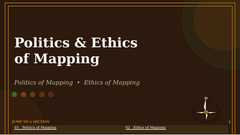</a> | — | — |
| Introduction, Foundations, and Data Management | [The Power of Maps & Map Types](00-introduction-to-gis.md) | <a class="deck" href="../slides/power-of-maps-map-types/" title="Slides: power of maps map types">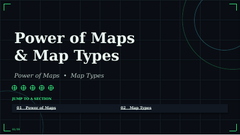</a> | — | [GIS & Cartography: 1.5 Map Fundamentals](https://slcc.pressbooks.pub/maps/chapter/1-5/){: .src-cartography}; [Essentials of GIS: Ch. 2 Map Anatomy](https://saylordotorg.github.io/text_essentials-of-geographic-information-systems/s06-map-anatomy.html){: .src-essentials} |
| Introduction, Foundations, and Data Management | [ArcGIS User Interface](01-getting-started.md) | <a class="deck" href="../slides/arcgis-pro-ui-tour/" title="Slides: arcgis pro ui tour">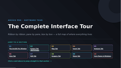</a> | — | [Esri: Introduction to ArcGIS Pro](https://doc.esri.com/en/arcgis-pro/latest/get-started/get-started.html){: .src-esri} |
| Introduction, Foundations, and Data Management | [Data Types](../concepts/vector-raster.md) [File Types in the ArcGIS Ecosystem; File Management, and Troubleshooting](02b-data-management.md) | <a class="deck" href="../slides/vector-vs-raster-data/" title="Slides: Data Types">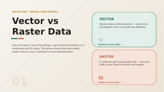</a> <a class="deck" href="../slides/file-types-management-troubleshooting/" title="Slides: File Types in the ArcGIS Ecosystem; File Management, and Troubleshooting">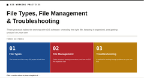</a> | — | [GIS & Cartography: 4.2 Raster Data Models](https://slcc.pressbooks.pub/maps/chapter/4-2/){: .src-cartography}; [GIS & Cartography: 4.3 Vector Data Models](https://slcc.pressbooks.pub/maps/chapter/4-3/){: .src-cartography}; [GIS & Cartography: 5.4 File Formats](https://slcc.pressbooks.pub/maps/chapter/5-4/){: .src-cartography}; [Esri: Data in ArcGIS Pro](https://doc.esri.com/en/arcgis-pro/latest/help/data/main/data-in-arcgis-pro.html){: .src-esri} |
| Introduction, Foundations, and Data Management | [Data Resources Exploration](02b-data-management.md); [Data Acquisition](02b-data-management.md); [Adding Data](02b-data-management.md) | <a class="deck" href="../slides/data-management/" title="Slides: Data Resources Exploration">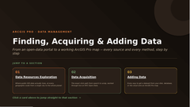</a>   | — | [Flexible GIS Workbook: Appendix A GIS Data Repositories](https://mlpp.pressbooks.pub/flexiblegisworkbookpro/back-matter/appendix/){: .src-workbook}; [GIS & Cartography: 5.2 Geographic Data Acquisition](https://slcc.pressbooks.pub/maps/chapter/5-2/){: .src-cartography}; [Essentials of GIS: Ch. 3 Data, Information, and Where to Find Them](https://saylordotorg.github.io/text_essentials-of-geographic-information-systems/s07-data-information-and-where-to-.html){: .src-essentials}; [Flexible GIS Workbook: 1.3 Add Data to the Map](https://mlpp.pressbooks.pub/flexiblegisworkbookpro/chapter/1-3-add-data-to-the-map/){: .src-workbook} |
| Introduction, Foundations, and Data Management | [Project, Map, Geodatabase, Feature Class, Shapefile, and Layer Creation](02-data-layers-coordinate-systems.md) | <a class="deck" href="../slides/project-map-geodatabase-feature-class-shapefile-layer/" title="Slides: project map geodatabase feature class shapefile layer">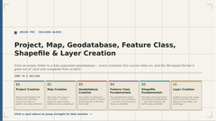</a> | — | [Flexible GIS Workbook: 1.1 Start a New Project](https://mlpp.pressbooks.pub/flexiblegisworkbookpro/chapter/chapter-1/){: .src-workbook}; [GIS & Cartography: 5.3 Geodatabases](https://slcc.pressbooks.pub/maps/chapter/5-3/){: .src-cartography} |
| Introduction, Foundations, and Data Management | [Coordinate and Projection Systems](../concepts/coordinate-systems.md) | <a class="deck" href="../slides/projection/" title="Slides: projection">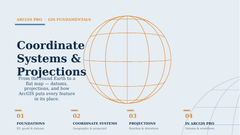</a> | — | [GIS & Cartography: 2.3 Datums, Coordinate Systems, and Map Projections](https://slcc.pressbooks.pub/maps/chapter/2-3/){: .src-cartography}; [Flexible GIS Workbook: 1.4 Change the Map Projection](https://mlpp.pressbooks.pub/flexiblegisworkbookpro/chapter/1-4-change-the-map-projection/){: .src-workbook} |
| Tabular Data and Mapping | [Attribute Table and Field](../concepts/attribute-tables.md) | <a class="deck" href="../slides/tabular-data-management/" title="Slides: tabular data management">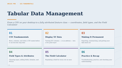</a> | [Attribute Table and Field](../labs/attribute-table-and-field/) | [GIS & Cartography: 3.2 Data and Information](https://slcc.pressbooks.pub/maps/chapter/3-2/){: .src-cartography} |
| Tabular Data and Mapping | [CSV Table Management, and Import](03c-tabular-data-management.md) |  | [CSV Table Management, and Import](../labs/attribute-table-and-field/) | [Flexible GIS Workbook: 2.2 Create Point Features from a Table](https://mlpp.pressbooks.pub/flexiblegisworkbookpro/chapter/2-2-create-point-features-from-a-table/){: .src-workbook} |
| Tabular Data and Mapping | [Field Creation, Editing, and Calculation](03c-tabular-data-management.md) |  | [Field Creation, Editing, and Calculation](../labs/attribute-table-and-field/) | [Flexible GIS Workbook: Ch. 3 Work With Data](https://mlpp.pressbooks.pub/flexiblegisworkbookpro/part/work-with-data/){: .src-workbook}; [GIS & Cartography: 6.2 Descriptions and Summaries](https://slcc.pressbooks.pub/maps/chapter/6-2/){: .src-cartography} |
| Tabular Data and Mapping | [Cartographic Principles: Map Elements, Design, Layout and Export](04-symbology-map-design.md) | <a class="deck" href="../slides/cartographic-principles/" title="Slides: cartographic principles">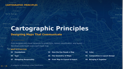</a> | [Cartographic Principles: Map Elements, Design, Layout and Export](../labs/data-classification-and-layout-design/) | [Essentials of GIS: Ch. 9 Cartographic Principles](https://saylordotorg.github.io/text_essentials-of-geographic-information-systems/s13-cartographic-principles.html){: .src-essentials}; [GIS & Cartography: 9.4 Cartographic Design](https://slcc.pressbooks.pub/maps/chapter/9-4/){: .src-cartography}; [Flexible GIS Workbook: 1.7 Create a Layout](https://mlpp.pressbooks.pub/flexiblegisworkbookpro/chapter/1-7-create-a-layout/){: .src-workbook}; [Flexible GIS Workbook: 1.8 Add Map Elements](https://mlpp.pressbooks.pub/flexiblegisworkbookpro/chapter/1-8-add-map-elements/){: .src-workbook}; [Esri Tutorial Path: Mapping and Visualization in ArcGIS Pro](https://learn.arcgis.com/en/paths/mapping-and-visualization-in-arcgis-pro/){: .src-esri} |
| Tabular Data and Mapping | [Map Classification](04-symbology-map-design.md) | <a class="deck" href="../slides/symbology-map-classification/" title="Slides: symbology map classification">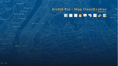</a> | [Map Classification](../labs/data-classification-and-layout-design/) | [GIS & Cartography: 6.4 Data Classification](https://slcc.pressbooks.pub/maps/chapter/6-4/){: .src-cartography} |
| Tabular Data and Mapping | [Select by Attributes](03-selection-by-attribute.md) | <a class="deck" href="../slides/select-by-attributes/" title="Slides: select by attributes">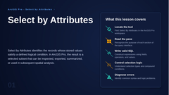</a> | [Select by Attributes](../labs/select-by-attributes/) | [GIS & Cartography: 6.3 Searches and Queries](https://slcc.pressbooks.pub/maps/chapter/6-3/){: .src-cartography} |
| Tabular Data and Mapping | [Select by Location](03b-selection-by-location.md) | <a class="deck" href="../slides/select-by-location/" title="Slides: select by location">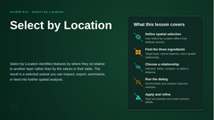</a> | [Select by Location](../labs/select-by-location/) | [GIS & Cartography: 6.3 Searches and Queries](https://slcc.pressbooks.pub/maps/chapter/6-3/){: .src-cartography} |
| Tabular Data and Mapping | [Table Join](03d-table-joins.md) | <a class="deck" href="../slides/table-join/" title="Slides: table join">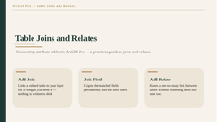</a> | [Table Join](../labs/table-join/) | [GIS & Cartography: 5.3 Geodatabases](https://slcc.pressbooks.pub/maps/chapter/5-3/){: .src-cartography} |
| Tabular Data and Mapping | [Spatial Join](07-spatial-joins.md) | <a class="deck" href="../slides/spatial-join/" title="Slides: spatial join">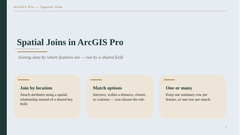</a> | [Spatial Join](../labs/spatial-join/) | [GIS & Cartography: 7.4 Multiple Layer Analysis](https://slcc.pressbooks.pub/maps/chapter/7-4/){: .src-cartography}; [Esri: Spatial Analysis in ArcGIS Pro](https://doc.esri.com/en/arcgis-pro/latest/help/analysis/introduction/spatial-analysis-in-arcgis-pro.html){: .src-esri} |
| Spatial Analysis | [Buffer](05-geoprocessing.md) | <a class="deck" href="../slides/geoprocessing-tools/" title="Slides: geoprocessing tools">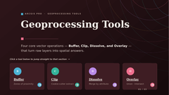</a> | [Buffer](../labs/buffer/) | [GIS & Cartography: 7.3 Single Layer Analysis](https://slcc.pressbooks.pub/maps/chapter/7-3/){: .src-cartography} |
| Spatial Analysis | [Clip](05-geoprocessing.md) |  | [Clip](../labs/clip/) | [Flexible GIS Workbook: Ch. 4 Perform Spatial Analysis](https://mlpp.pressbooks.pub/flexiblegisworkbookpro/part/ch4-perform-spatial-analysis/){: .src-workbook} |
| Spatial Analysis | [Dissolve](05-geoprocessing.md) |  | [Dissolve](../labs/dissolve/) | [Essentials of GIS: Ch. 7 Geospatial Analysis I: Vector Operations](https://saylordotorg.github.io/text_essentials-of-geographic-information-systems/s11-geospatial-analysis-i-vector-o.html){: .src-essentials} |
| Spatial Analysis | [Overlay (Union/Intersect)](05-geoprocessing.md) |  | [Overlay](../labs/overlay/) | [GIS & Cartography: 7.4 Multiple Layer Analysis](https://slcc.pressbooks.pub/maps/chapter/7-4/){: .src-cartography} |
| Spatial Analysis | [Raster Analysis: Surface Analysis](06-raster-analysis.md) | <a class="deck" href="../slides/raster-data-analysis/" title="Slides: raster data analysis">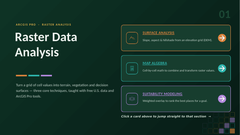</a> | [Surface Analysis](../labs/surface-analysis/) | [GIS & Cartography: 8.6 Terrain Mapping for Spatial Analysis](https://slcc.pressbooks.pub/maps/chapter/8-6/){: .src-cartography}; [Esri Tutorial Path: Raster Data and Imagery in ArcGIS Pro](https://learn.arcgis.com/en/paths/using-raster-data-and-imagery-in-arcgis-pro/){: .src-esri} |
| Spatial Analysis | [Map Algebra](06-raster-analysis.md) |  | [Map Algebra](../labs/map-algebra/) | [GIS & Cartography: 8.3 Geoprocessing with Raster Imagery](https://slcc.pressbooks.pub/maps/chapter/8-3/){: .src-cartography}; [Essentials of GIS: Ch. 8 Geospatial Analysis II: Raster Data](https://saylordotorg.github.io/text_essentials-of-geographic-information-systems/s12-geospatial-analysis-ii-raster-.html){: .src-essentials} |
| Spatial Analysis | [Suitability Modeling](06-raster-analysis.md) |  | [Suitability Modeling](../labs/suitability-modeling/) | [GIS & Cartography: 8.3 Geoprocessing with Raster Imagery](https://slcc.pressbooks.pub/maps/chapter/8-3/){: .src-cartography}; [GIS & Cartography: 8.4 Scale of Raster Analysis](https://slcc.pressbooks.pub/maps/chapter/8-4/){: .src-cartography}; [Esri: Spatial Analysis in ArcGIS Pro](https://doc.esri.com/en/arcgis-pro/latest/help/analysis/introduction/spatial-analysis-in-arcgis-pro.html){: .src-esri} |
| Spatial Analysis | [Intro to Geospatial Programming](08-geospatial-programming.md) | <a class="deck" href="../slides/geospatial-programming-intro/" title="Slides: geospatial programming intro">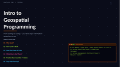</a> | [Intro to Geospatial Programming](../labs/intro-to-geospatial-programming/) | [Esri: ArcGIS Pro Python Reference](https://doc.esri.com/en/arcgis-pro/latest/arcpy/main/arcgis-pro-arcpy-reference.html){: .src-esri}; [Esri Tutorial Path: Analysis in ArcGIS Pro](https://learn.arcgis.com/en/paths/analysis-in-arcgis-pro/){: .src-esri} |
| Future of GISc | [Future of GISc](09-future-of-gisc.md) | <a class="deck" href="../slides/future-of-gis/" title="Slides: future of gis">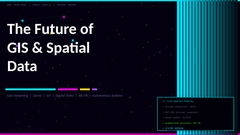</a> | — | [GIS & Cartography: 1.7 Future of Mapping Technology](https://slcc.pressbooks.pub/maps/chapter/1-7/){: .src-cartography}; [Esri: What's New in ArcGIS Pro](https://doc.esri.com/en/arcgis-pro/latest/get-started/whats-new-in-arcgis-pro.html){: .src-esri} |

